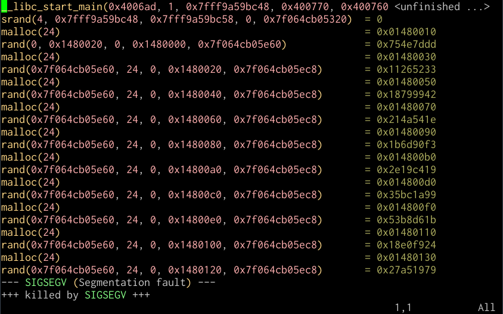

调试
====

程序在运行时有意料之外的行为时，Linux 提供了广泛而多样的命令行工具来诊断问题。用集成开发环境工具设断点来在程序运行时检查程序状态的朋友应该会对 ``gdb``\（GNU debugger），以及其相关的较没名气的 Perl 调试程序比较熟悉。其他还有一些工具则更专注于观察程序和系统的交互以及系统资源使用的细节。

用 ``gdb`` 做调试
-----------------

你可以用类似 Eclipse 和 Visual Studio 的调试方式去使用 ``gdb``\。如果你在调试一个你刚刚编译好的程序，编译时加个调试标签是有道理的。你只需要在用 ``gcc`` 编译的时候加上个 ``-g`` 的选项。如果代码写得有问题，你也可以加上 ``-Wall``\，这样所有的错误信息都会显示： ::
    
    $ gcc -g -Wall example.c -o example

``gdb`` 的经典用法就是在命令行下运行 C 或 C++ 编译的程序，从而在其运行直至崩溃时观察程序的状态。 ::
    
    $ gdb example
    ...
    Reading symbols from /home/tom/example...done.
    (gdb)
    
在 ``(gdb)`` 交互命令下，你可以输入 ``run`` 来运行程序，它会反馈给你更多有关导致错误的细节信息，比如下例的内存访问越界错误、出错的源码文件以及出错的代码行号。如果你像上面提到的那样在编译时加入调试符并观察其运行，排错任务会变得非常简单。 ::
    
    (gdb) run
    Starting program: /home/tom/gdb/example 

    Program received signal SIGSEGV, Segmentation fault.
    0x000000000040072e in main () at example.c:43
    43     printf("%d\n", *segfault);

在错误终止程序之后，你可以在 ``(gdb)`` 命令行下输入 ``backtrace`` 查看刚刚是哪一个功能模块运行了，传进该功能模块的参数也可能跟程序的崩溃有关。 ::
    
    (gdb) backtrace
    #0  0x000000000040072e in main () at example.c:43

你也可以用 ``break`` 来为 ``(gdb)`` 设置断点，这样程序运行到相应行号或某模块调用的时候就会暂停： ::
    
    (gdb) break 42
    Breakpoint 1 at 0x400722: file example.c, line 42.
    (gdb) break malloc
    Breakpoint 1 at 0x4004c0
    (gdb) run
    Starting program: /home/tom/gdb/example 

    Breakpoint 1, 0x00007ffff7df2310 in malloc () from /lib64/ld-linux-x86-64.so.2

其后，用 ``step`` 来单步调试之后的代码会非常有帮助。你可以像使用其他 ``(gdb)`` 命令一样，按回车键重复单步调试： ::
    
    (gdb) step
    Single stepping until exit from function _start,
    which has no line number information.
    0x00007ffff7a74db0 in __libc_start_main () from /lib/x86_64-linux-gnu/libc.so.6

你甚至可以将 ``gdb`` 附到一个正在运行的进程上，只需要找到该进程的 ID 并将此 ID 传入 ``gdb``\： ::
    
    $ pgrep example
    1524
    $ gdb -p 1524

这样做对 `重定向某些耗时长的任务的输出流 <http://stackoverflow.com/questions/593724/redirect-stderr-stdout-of-a-process-after-its-been-started-using-command-lin>`_ 很有帮助。

用 ``valgrind`` 调试
--------------------

较新的 `valgrind <http://valgrind.org/>`_ 可以用类似的方法来用作调试工具。它有好多种检测和调试的方式，但是有一种是最为有用的，即 Memcheck 工具，这个工具可以用来侦测常见的类似缓冲区溢出的内存错误： ::
    
    $ valgrind --leak-check=yes ./example
    ==29557== Memcheck, a memory error detector
    ==29557== Copyright (C) 2002-2011, and GNU GPL'd, by Julian Seward et al.
    ==29557== Using Valgrind-3.7.0 and LibVEX; rerun with -h for copyright info
    ==29557== Command: ./example
    ==29557== 
    ==29557== Invalid read of size 1
    ==29557==    at 0x40072E: main (example.c:43)
    ==29557==  Address 0x0 is not stack'd, malloc'd or (recently) free'd
    ==29557== 
    ...
        
``gdb`` 和 ``valgrind`` 可以 `组合使用 <http://valgrind.org/docs/manual/manual-core-adv.html#manual-core-adv.gdbserver>`_ 从而更加全面的观察程序运行。 Zed Shaw 写的 `《笨办法学 C 语言》 <http://c.learncodethehardway.org/book/>`_ 中就有个对 ``valgrind`` 非常好的介绍，有关如何用一些入门用法来调试某故意弄错的程序。

利用 ``ltrace`` 追踪系统和库的调用
----------------------------------

``strace`` 和 ``ltrace`` 是为查看某程序的系统和库调用情况而设计的，追踪结果可以被显示在屏幕上也可以被写入到文件。

将你想监视的程序作为参数传进 ``ltrace`` 就可以开始监视了。它会将程序从头到尾调用的所有的系统和库都列出来。 ::
    
    $ ltrace ./example
    __libc_start_main(0x4006ad, 1, 0x7fff9d7e5838, 0x400770, 0x400760 
    srand(4, 0x7fff9d7e5838, 0x7fff9d7e5848, 0, 0x7ff3aebde320) = 0
    malloc(24)                                                  = 0x01070010
    rand(0, 0x1070020, 0, 0x1070000, 0x7ff3aebdee60)            = 0x754e7ddd
    malloc(24)                                                  = 0x01070030
    rand(0x7ff3aebdee60, 24, 0, 0x1070020, 0x7ff3aebdeec8)      = 0x11265233
    malloc(24)                                                  = 0x01070050
    rand(0x7ff3aebdee60, 24, 0, 0x1070040, 0x7ff3aebdeec8)      = 0x18799942
    malloc(24)                                                  = 0x01070070
    rand(0x7ff3aebdee60, 24, 0, 0x1070060, 0x7ff3aebdeec8)      = 0x214a541e
    malloc(24)                                                  = 0x01070090
    rand(0x7ff3aebdee60, 24, 0, 0x1070080, 0x7ff3aebdeec8)      = 0x1b6d90f3
    malloc(24)                                                  = 0x010700b0
    rand(0x7ff3aebdee60, 24, 0, 0x10700a0, 0x7ff3aebdeec8)      = 0x2e19c419
    malloc(24)                                                  = 0x010700d0
    rand(0x7ff3aebdee60, 24, 0, 0x10700c0, 0x7ff3aebdeec8)      = 0x35bc1a99
    malloc(24)                                                  = 0x010700f0
    rand(0x7ff3aebdee60, 24, 0, 0x10700e0, 0x7ff3aebdeec8)      = 0x53b8d61b
    malloc(24)                                                  = 0x01070110
    rand(0x7ff3aebdee60, 24, 0, 0x1070100, 0x7ff3aebdeec8)      = 0x18e0f924
    malloc(24)                                                  = 0x01070130
    rand(0x7ff3aebdee60, 24, 0, 0x1070120, 0x7ff3aebdeec8)      = 0x27a51979
    --- SIGSEGV (Segmentation fault) ---
    +++ killed by SIGSEGV +++

你同样也可以将其附到某已运行的进程上： ::
    
    $ pgrep example
    5138
    $ ltrace -p 5138

一般情况，监视结果会超过一屏，所以用 ``-o`` 来设定一个输出文件会很有用，这样结果就全被记录到该文件里了： ::
    
    $ ltrace -o example.ltrace ./example

然后在用类似于 Vim 的工具打开 trace 文件， ``ltrace`` 文件会被语法高亮：

   :alt ltrace-vim

   用 Vim 打开 ltrace 文件

我发觉在调试误连接或在 ``chroot`` 环境下缺某些资源时候用 ``ltrace`` 特别有用，因为输出信息显示了它在动态连接时搜索库文件、打开 ``/etc`` 下的配置文件、以及使用像 ``/dev/random`` 或 ``/dev/zero`` 这样的设备。

利用 ``lsof`` 监视打开的文件
-----------------------------

如果你想查看一个正在运行的进程打开了哪些设备、文件或流，你可以使用 ``lsof``\： ::
    
    $ pgrep example
    5051
    $ lsof -p 5051

举个例子，我家里服务器里的 ``apache2`` 进程的开始几行是这样的： ::
    
    # lsof -p 30779
    COMMAND   PID USER   FD   TYPE DEVICE SIZE/OFF    NODE NAME
    apache2 30779 root  cwd    DIR    8,1     4096       2 /
    apache2 30779 root  rtd    DIR    8,1     4096       2 /
    apache2 30779 root  txt    REG    8,1   485384  990111 /usr/lib/apache2/mpm-prefork/apache2
    apache2 30779 root  DEL    REG    8,1          1087891 /lib/x86_64-linux-gnu/libgcc_s.so.1
    apache2 30779 root  mem    REG    8,1    35216 1079715 /usr/lib/php5/20090626/pdo_mysql.so
    ...

有趣的是，还有另一种办法可以办到这个，就是检查动态目录 ``/proc`` 里的相应记录： ::
    
    # ls -l /proc/30779/fd

这在遇到文件锁的令人困惑的情况或鉴定某进程是否保有不需要用到的文件的时候非常有用。

用 ``pmap`` 查看内存分配
------------------------

最后一个调试小技巧，你可以用 ``pmap`` 查看某进程的内存分配情况： ::
    
    # pmap 30779 
    30779:   /usr/sbin/apache2 -k start
    00007fdb3883e000     84K r-x--  /lib/x86_64-linux-gnu/libgcc_s.so.1 (deleted)
    00007fdb38853000   2048K -----  /lib/x86_64-linux-gnu/libgcc_s.so.1 (deleted)
    00007fdb38a53000      4K rw---  /lib/x86_64-linux-gnu/libgcc_s.so.1 (deleted)
    00007fdb38a54000      4K -----    [ anon ]
    00007fdb38a55000   8192K rw---    [ anon ]
    00007fdb392e5000     28K r-x--  /usr/lib/php5/20090626/pdo_mysql.so
    00007fdb392ec000   2048K -----  /usr/lib/php5/20090626/pdo_mysql.so
    00007fdb394ec000      4K r----  /usr/lib/php5/20090626/pdo_mysql.so
    00007fdb394ed000      4K rw---  /usr/lib/php5/20090626/pdo_mysql.so
    ...
    total           152520K

 以上的结果可以显示出在运行的进程使用了哪些库，包括那些在共享内存里的库。最后给出的总计可能会有点令人误解，因为正在运行的进程很有可能加载了共享库，而此进程也不一定是唯一在用此库的进程。当某进程调用共享库的时候， `确定此进程的“真实”内存使用 <http://stackoverflow.com/questions/118307/a-way-to-determine-a-processs-real-memory-usage-i-e-private-dirty-rss>`_ 要比想象中的情况更加复杂。
